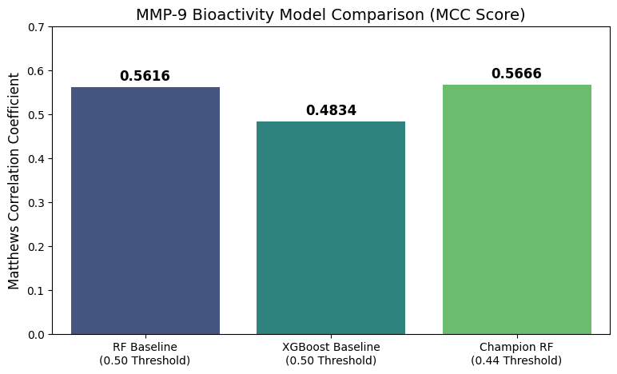

# MMP-9 Drug Discovery Pipeline
**AI-Driven Virtual Screening for Novel Cancer Therapeutics**

## 🔬 Project Overview
Matrix Metalloproteinase-9 (MMP-9) is a key enzyme involved in cancer metastasis. This project uses machine learning to identify potential inhibitors by training on known bioactivity data and screening FDA-approved drugs for repurposing opportunities.

## 📊 Performance Highlights
* **Model:** Optimized Random Forest (ECFP4 Fingerprints)
* **Champion MCC:** 0.6277 (Matthews Correlation Coefficient)
* **Custom Decision Threshold:** 0.4417 (Optimized for high precision)
* **Key Findings:** Successfully identified Zinc-binding ACE inhibitors (Enalapril) as potential hits.

## 🏗️ System Architecture (OOP)
* `main.py`: Master orchestrator for the end-to-end pipeline.
* `app.py`: **Streamlit Web Dashboard** for single-molecule and batch prediction.
* `ingest.py`: Automated ChEMBL API retrieval and pIC50 transformation.
* `preprocess.py`: Scaffold Splitting and **SMOTE** class balancing.
* `training.py`: Model serialization and metadata management.
* `screen.py`: Virtual Screening with **Lipinski's Rule of 5** filtering.

## 🚀 How to Run
1. **Install:** `pip install -r requirements.txt`
2. **Train & Screen:** `python src/main.py`
3. **Launch UI:** `streamlit run src/app.py`

## 🧠 Data Science Insights
* **Imbalance Handling:** Handled a 3:1 class imbalance using SMOTE to improve minority class recall.
* **Structural Integrity:** Utilized Murcko Scaffold splitting to ensure the model generalizes to novel chemical structures.

